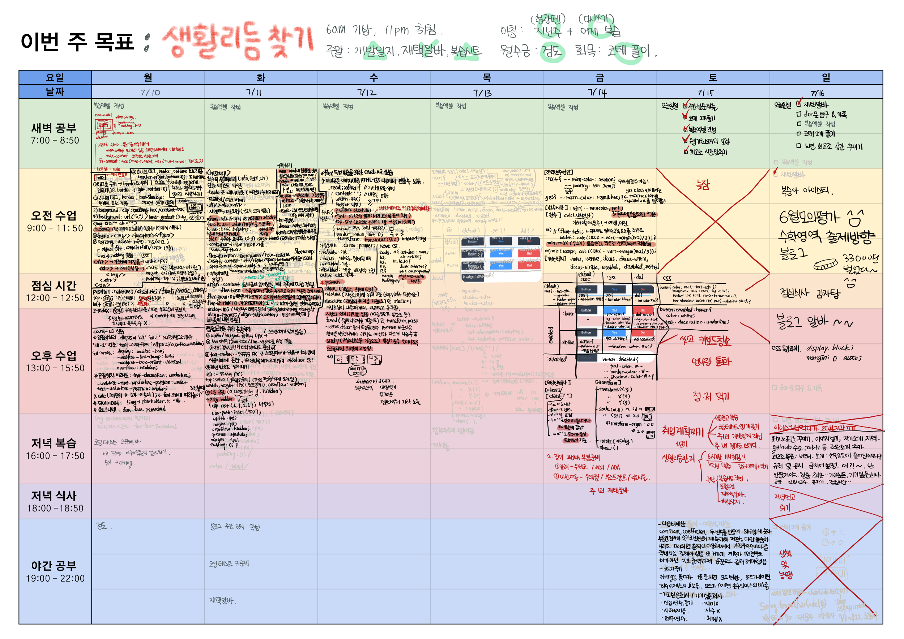

# blog
0. 개요
    * 멋쟁이 사자처럼 테킷스쿨의 프론트엔드스쿨 7기 수강 2주차 주말이다.

1. 복습 방법
    * 계획표 겸 사후기록표 제작
    * > 매 시간마다 1시간 동안 무얼 했는지 기록하는 표
     수업을 했다면 수업 내용을 생각나는대로 적어도 좋고, 다른 일을 했다면 어떤 일을 했는지 놀았어도 뭘 하고 놀았는지 적어두면 시간은 많이 지났는데, 나 뭐했지? 싶을 때 보면 뭘 했는지 알 수 있음. 
        
    * 계획 짜기
    * 기록 하기
    * 다음 날 아침에 그 위에 따라쓰면서 복습
    * 다음 주 아침에 따라 쓴 글을 읽으면서 복습

            
