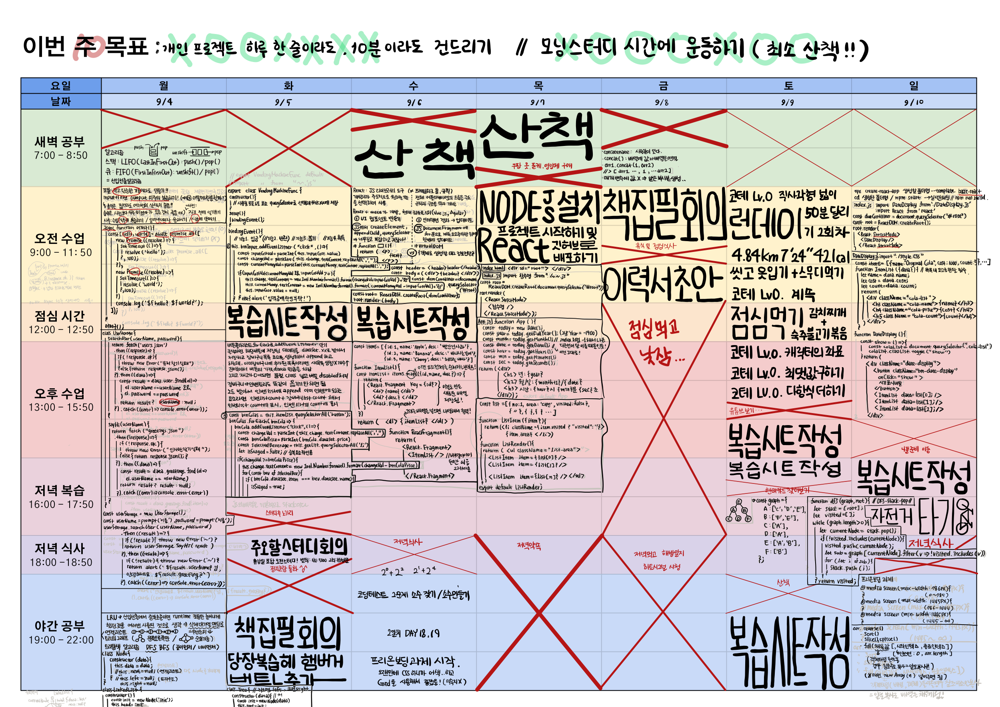
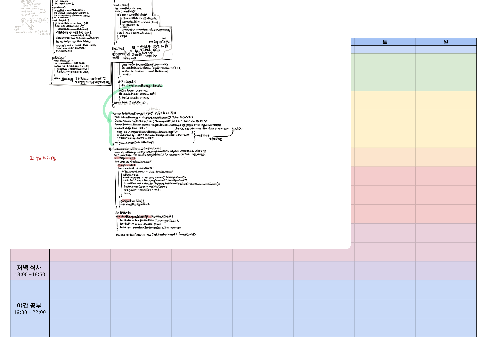

# 10주차 복습

## [JS]
### `2023 09 04 월` [[JS] async/await, fetch.then.catch, ](https://github.com/sthgml/FES7/commit/385b40700fcedd73579595b3973cc2ec08297ddc)
- [책집필] DFS/BFS
- promise 두 개 한 꺼번에 반환하기

### `2023 09 05 화` [[JS] 벤딩머신 실습](https://github.com/sthgml/FES7/commit/3d5bed3bed215eebf2236e28f2f0923a35c04d06) [[review-note] 햄버거 버튼 추가, modal 추가](https://github.com/sthgml/FES7/commit/e77046f6853cbac116e5261ae8d0e568f98dc178)
- 벤딩머신에 자바스크립트로 기능 넣기
- 버튼 콜라리스트에 addEventListener 달아서 dataset.xx로 받아서 목록 생성
- 이미 장바구니에 추가된 목록인지 isStaged로 비교하여 append하기

### `2023 09 06 수` [[React] JSX 문법](https://github.com/sthgml/FES7/commit/9b41520125b4e4971da90966e807eab80994895b), [[PreOnbd] 과제](https://github.com/sthgml/FES7/commit/9b41520125b4e4971da90966e807eab80994895b)
- 소괄호 안에 HTML
- 중괄호 안에 JS
- Virtual DOM

### `2023 09 07 목` [[React] npm, 리액트 프로젝트](https://github.com/sthgml/FES7/commit/5271a789d23d9fa58a44b11be098c211f674a34f)

### `2023 09 08 금` [[First React Project]](https://github.com/sthgml/FES7/commit/108afb5970078593c201f032de593a82c973d0d8)

### `2023 09 09 토` [[코딩테스트] lv.0 ](https://github.com/kkang123/Programmers_Algorithm/commit/9c86389f077fcd196c683469174f9d8ab4b3295e)

### `2023 09 10 일` [[React복습]](https://github.com/sthgml/FES7/commit/30a2065fa3b982ee2ae51611bf5287298d9bfed5) [[책집필]](https://github.com/sthgml/FES7/commit/b858803b32c4f46d7e30027b8bdde2c47d76a4e9) [[PreOnbd] 반응형 레이아웃 추가](https://github.com/sthgml/FES7/commit/b858803b32c4f46d7e30027b8bdde2c47d76a4e9)
- 배열 메서드 concat(), slice(), splice(), sort(), fill()