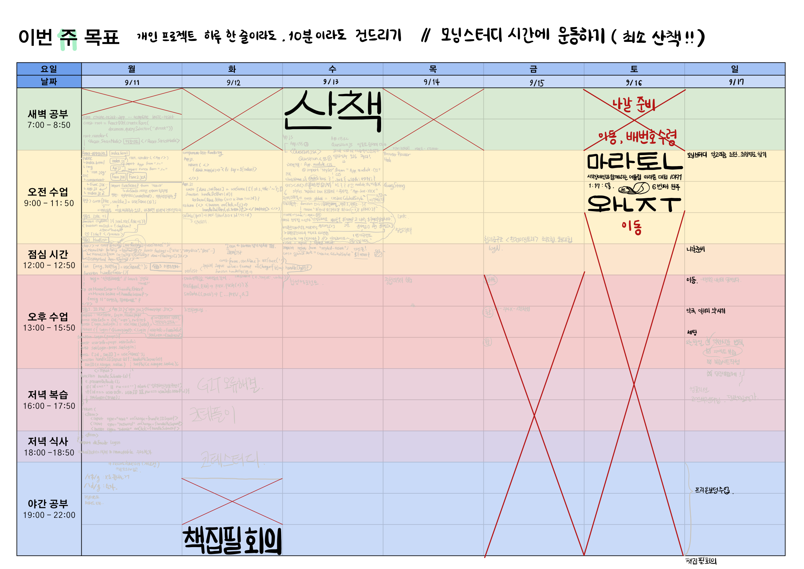

# 11주차 복습

## [React 리액트]
### `2023 09 11 월` [[React] useState ](https://github.com/sthgml/FES7/commit/9f136d325f9917517d7e94102d9db461f982f580)
- import { useState } from 'react'
- const [like, setLike] = useState(0)

### `2023 09 12 화` [[React] 리스트, 조건부 렌더링](https://github.com/sthgml/FES7/commit/af92b59558e5a7aadca06de1c7797d5cef57186d) 

### `2023 09 13 수` [[React] 스타일 컴포넌트](https://github.com/sthgml/FES7/commit/9b41520125b4e4971da90966e807eab80994895b)
- styled-components 
> - createGlobalStyle``
> - styled-reset ${reset}
> - styled.div``
> - 태그드 템플릿 등...
- composition (합성 컴포넌트 - ex. App > Card > CardDiv)

### `2023 09 14 목` [[React] 라우터, useEffect ](https://github.com/sthgml/FES7/commit/6deaf665943c5a42a2d682c76a1eb286f8d1dce0)
- router (BrowserRouter > Link / Routes > <Route path="/url/" element={<컴포넌트/>}>)
- useEffect

### `2023 09 15 금` [책집필]힙자료구조

### `2023 09 16 토` 마라톤, 코테풀이
- 시각장애인과 함께하는 어울림 마라톤, 10km : 1시간 17분
- [[코딩테스트] lv.0](https://github.com/sthgml/Programmers_Algorithm/commit/70275e1d4f6c463eb35befe09de0a56f4c051012)

### `2023 09 17 일` [[React 과제] 1만시간의법칙](https://github.com/sthgml/FES7/commit/7bfa4c2577b80175c6b0282f9db063c13c41efb4), [[책집필] 알고리즘 ](https://github.com/sthgml/FES7/commit/f513f5a01c68fcb69c7194b086fdd6bc0dc3feb9)
- 합성 컴포넌트 (composition)
- 스타일드 컴포넌트 (styled-components)
- 조건부 렌더링 활용해서 모달 띄우기
- 알고리즘 (최단경로, 최장경로찾기)

## [개선점] 이번 주는 반성할 게 많다.
### `1. 시간관리` 
- 외모, 쇼핑 등에 눈 돌아가는 시간이 늘어남
- 복습시트 작성이 부담스러워짐
- 할 일이 쌓이니까 '하기 싫다'는 생각 때문에 오히려 아무것도 안 함
- <strong style="color:salmon">▶  한 가지 일을 오래 잡고 있지 말고 시간을 정해놓고 돌릴 것!</strong>

### `2. 체력관리`
- 기상시간이 늦춰지면서 복습 시트 작성 시간도 부족
- 자도 자도 피곤하고, 마라톤 기록도 느려졌음
- <strong style="color:salmon">▶ 검도든 달리기든 주 3회는 하려고 노력할 것!!</strong>

### `3. 학습`
- 수업시간에 집중을 못하고 있음.
- 책집필, 스터디 등 부수적인 활동을 여러가지 하고 있지만 가장 중요한 것은 수업 내용을 최대한 습득하는 것인데 그걸 놓치고 있음. 
- <strong style="color:salmon">▶ 쉬는 시간에 복습 시트 작성하려고 하지 말고 수업 중간 중간 키워드 써놓거나 아예 필기를 할 것!!! </strong>