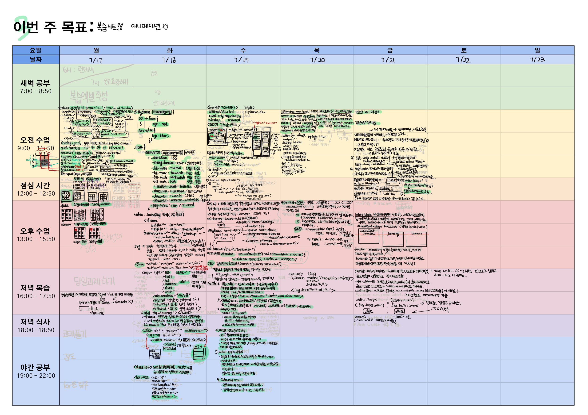

# 3주차 복습

## [HTML-CSS]
### `2023 07 17 월` [table, display grid](https://github.com/sthgml/FES7/commit/56c2dd237dcdbb337fba0a5aa2f1011cf703cd62)

- [commit - 1 grid](https://github.com/sthgml/FES7/commit/cf02c0e20bc749723414bcd280a6ad57eaa556f6)

### `2023 07 18 화` animation, video, svg, form태그, label, datalist, testarea

- [commit - 2 animation-alternate](https://github.com/sthgml/FES7/commit/f08558218647da1701cad4f5d7a38e708818bd62)
- [commit - 3 animation fill mode](https://github.com/sthgml/FES7/commit/6b2ede952a4415f47798407998702828ee6f13d4)
- [commit - 4 hamburger btn](https://github.com/sthgml/FES7/commit/91405cc8cbe9819eb541dcd6d5d4453930111ee8)
- [commit - 5 video](https://github.com/sthgml/FES7/commit/f827e08af881ae5033a28734dac15f6b35ba41d6)
- [commit - 6 svg img](https://github.com/sthgml/FES7/commit/dfe61ea2e6fd0938635880247474e853ddd38465)
- [commit - 7 form tag](https://github.com/sthgml/FES7/commit/9880b416045b7861dfa04e634a173bb7b6042fd1)

### `2023 07 19 수` form관련 가상선택자, 페이지 구조분석, CSS 클래스 재사용 고려하기, 미디어쿼리, 검색엔진 최적화
`@media (max-width:568px) { body {
    width: 368px;
}},`
- [commit - 1 input pseudo selecotr](https://github.com/sthgml/FES7/commit/6098912dfb030fd8a2fa39512268bcc99ae15a87) 
- [commit - 2 diary-page practice](https://github.com/sthgml/FES7/commit/26b6713379279a5e44c9fef39abee85185584edb) 
- [commit - 3 diary-page practice](https://github.com/sthgml/FES7/commit/11f58a04369c5d14f48a70638c43f0846df4dc61) 
- [commit - 1 mediaquery practice](https://github.com/sthgml/FES7/commit/83690babaeb0dbb45227afe7b7792b346b9ce6be) 

### `2023 07 20 목` 두근두근 다이어리 실습
- [commit -1 diary-page main](https://github.com/sthgml/FES7/commit/ee333970a01aeb0af35f48b16f5b7f5f6d0de52b)  
- [commit -2 create 0720 folder](https://github.com/sthgml/FES7/commit/65759d8b154c2f1deba076dcecd5a71c1148690b)  
- [commit -3 3d perspective practice](https://github.com/sthgml/FES7/commit/751080738a62d149b841447ccb935c1339d984dd)

### `2023 07 21 금` [특강 Day] 웹접근성의 중요성, CSS 세부특강
- [특강 과제](https://github.com/sthgml/FES7/commit/8f88cebfc212036387c1aae3589d6182fe858e2a)