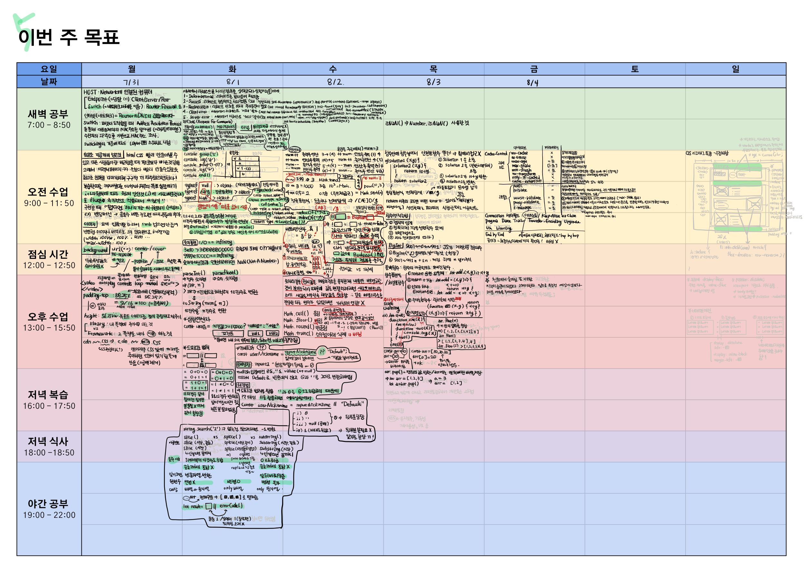

# 5주차 복습

## [JS]
### `2023 07 31 월` HTML CSS 실무 스킬
### `2023 08 01 화` console, typeof, typecheck, 부동소수점, 숫자표현, parseInt, parseFloat, toString, 삼항연산자, 드모르간 법칙, 널리쉬
### `2023 08 02 수` 연산자, Math 객체, 비트연산자
### `2023 08 03 목` isNaN 대신 Number.isNaN을 사용할 것, BigInt, 콜백함수, 함수표현식(화살표함수)
### `2023 08 04 금` HTTP Cache-Control 헤더필드의 디렉티브와 파라미터 종류
Connection 헤더필드, Hop-by-Hop 헤더필드,
End-to-End 헤더필드