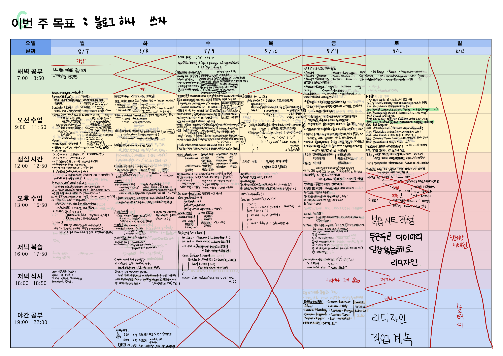

# 6주차 복습

## [JS]
### `2023 08 07 월` [[ JS Array Method ](https://github.com/sthgml/FES7/commit/058ea9b74f2acccdee09540a6048f71b9461c23c)]
> 1. push
> 2. pop
> 3. shift
> 4. unshift
> 5. splice
> 6. slice
> 7. sort
> 8. forEach
> 9. Map 
> 10. filter
> 11. includes
> 12. reduce
> 13. join

### `2023 08 08 화` [[ BootStrap ](https://github.com/sthgml/FES7/commit/116a478aeb002d338a4657f77cd9fb9cb6e2bcb4) ]

### `2023 08 09 수` [[ JS if-else / switch 조건문 ](https://github.com/sthgml/FES7/commit/ad27de02e5f5cddee6426af83bb826d954543e54)] 

### `2023 08 10 목` [[ JS 반복문 ](https://github.com/sthgml/FES7/commit/ad27de02e5f5cddee6426af83bb826d954543e54)]

### `2023 08 11 금` [ 특강 day ]
1. [github-목차와 체크리스트](https://github.com/sthgml/FES7/commit/e2a7da408d0a489f8ef4fbb36634ee03c0a6341f)
1. [github-커밋메시지 이슈 연동](https://github.com/sthgml/FES7/commit/e2a7da408d0a489f8ef4fbb36634ee03c0a6341f)
2. [FE 주니어 개발자 특강](https://github.com/sthgml/FES7/commit/2309f9c8d0dc72bdc27876674e21c35880586b90)

### `2023 08 12 토` [휴강일] HTTP 공부 + 당장 복습헤! 
1. HTTP
    - 상태코드
        - 1xx 처리중
        - 2xx OK
        - 3xx Redirection
        - 4xx Client Error
        - 5xx Server Error
    - 중간 중간
        - 게이트웨이
        - 프록시
        - 가상호스트
1. [당장 복습헤! 디자인](https://github.com/sthgml/FES7/commit/c7f143cc0a18b035a71838381d67b0358a683c1e)