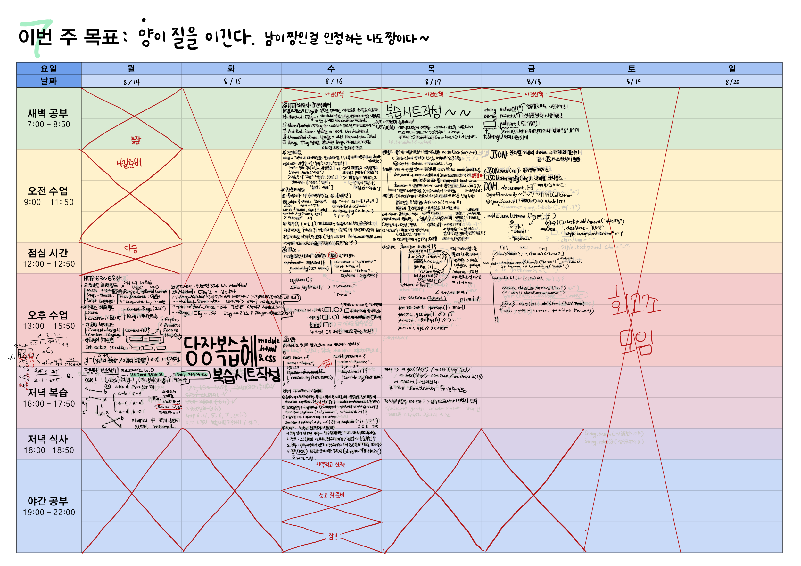

# 7주차 복습

## [JS]
### `2023 08 14 월` [휴강일] 사당 모각코
1. HTTP 헤더필드
> - HTTP 리퀘스트 헤더필드
> - HTTP 리스폰스 헤더필드
> - 엔티티 헤더필드
2. [PGS] Lv.0 평행인 선분 풀이

### `2023 08 15 화` [휴강일] [review-note] 당장 복습헤! 코딩 시작!
1. [module.html, module.css](https://github.com/sthgml/FES7/commit/0c17b3425cd925ba507e8ab321d1604bfe9ed221)

### `2023 08 16 수` [[JS 전개구문, 구조분해할당, this](https://github.com/sthgml/FES7/commit/0a348d8c36e05aec7b6b769d46947f26ce2b150c) ]
### `2023 08 17 목` [[JS 콜백함수, 호이스팅, 재귀함수, 클로저](https://github.com/sthgml/FES7/commit/e1f65b7030f6b17750ef5edb5e685137bbf8bbbb)]
### `2023 08 18 금` [[JS JSON, DOM](https://github.com/sthgml/FES7/commit/4b80547d6f7c606d44612265db7f96fcd13aa2f2)]