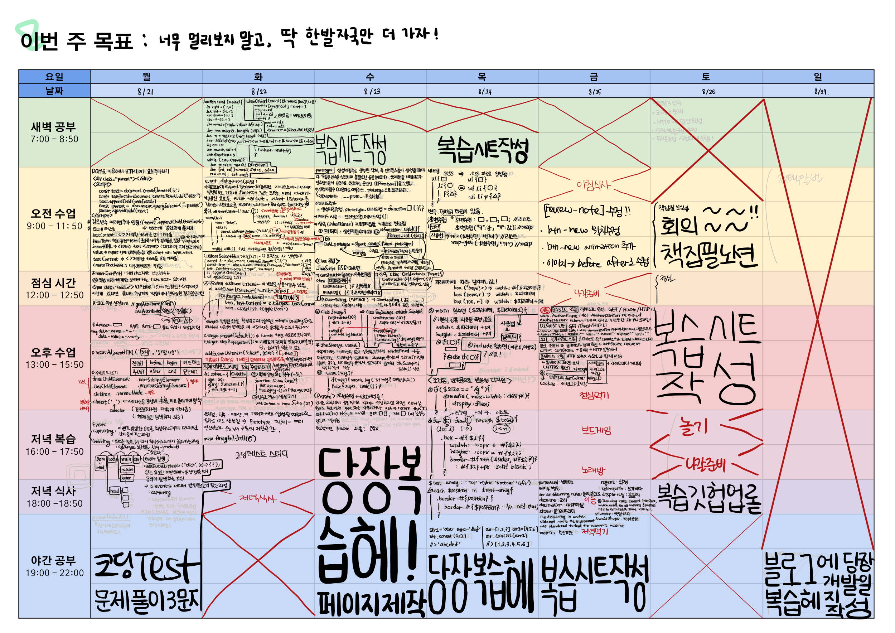

# 8주차 복습

## [JS]
### `2023 08 21 월` [[JS] DOM 심화](https://github.com/sthgml/FES7/commit/7c7dd84f185476c8fe748950d0a77361a80a485d)
1. createTextNode("")
2. appendChild(a) / append(a,b)
3. 요소 내 컨텐츠를 가져오는 프로퍼티 비교
> - innerText : 렌더링된 결과물의 텍스트
> - innerHTML : HTML 태그 내 코드 몽땅
> - textContent : 자손들을 포함한 태그 내 텍스트 모두
> - value : input 안에 입력받은 값
4. 요소 속성 설정하기 getAttribute('속성명')/ setAttribute('속성명', '속성값')
5. 노드.dataset.xx >> 속성 중 data-xx = "xx" 의 속성값을 가져옴
6. insertAdjacentHTML("위치", "들어갈 내용")
> - beforebegin : 여는태그 앞에
> - afgerbegin : 여는태그 뒤에
> - beforeend : 닫는태그 앞에
> - afterend : 닫는태그 뒤에
7. capturing / bubbling 이벤트가 발생한 요소를 최상위 노드부터 순차적으로 찾아들어가는 과정인 캡처링의 부산물로 요소를 찾은 뒤 다시 최상위 노드까지 올라가는 과정인 버블링이 일어난다.

### `2023 08 22 화` [[JS] event, 객체, 생성자, 프로토타입](https://github.com/sthgml/FES7/commit/0289ab215923abc2df5579fe5a2a7e8b2a73b476)
- 이벤트 위임 event Deligation
- 커스텀 셀렉트 박스
- 객체지향 프로그래밍 - 추상화
- 프로토타입 - 인스턴스들이 공유하는 공통의 공간

### `2023 08 23 수` [[JS] class, 상속, private](https://github.com/sthgml/FES7/commit/014130548032ddabb6ee4d4d7b15218e33903d3a)
- 생성자 함수(대문자로 시작)은 .prototype으로 접근, 객체는 .__proto__로 접근
- 프로토타입에 메서드 추가 
> - 생성자함수명.prototype.메서드명 = function(){} 
- 상속 : class 클래스명 extends 부모 {}
- 오버라이딩, 오버로딩
- 프라이빗 프로퍼티 ex. #password

### `2023 08 24 목` [[Sass]](https://github.com/sthgml/FES7/commit/eb957ce602e43790e484a80b2816172e9e226404), [review-note 페이지 수정]
- [[review-note]join, login.html](https://github.com/sthgml/FES7/commit/23a0c9f50e2721aa7df008f8109532d9f88755cc)
- [[review-note]index.html](https://github.com/sthgml/FES7/commit/e0f3eefe63cc9d48ee4839a8f89d7314790c5536)
- [Update: 메인페이지 로그아웃버튼 링크연결, 소셜로그인 버튼 추가](https://github.com/sthgml/FES7/commit/c60df0d094846bb91fc1b704b11c3309947def0c)
- [Update: [review-note] 탭으로 기록 분류, 신규 기록 작성 모달 분리](https://github.com/sthgml/FES7/commit/eac75f7b66391479e3c4d57618185e1abc60dba5)

### `2023 08 25 금` [[Update: [review-note] btn-new 아이콘, 위치 수정](https://github.com/sthgml/FES7/commit/1ca9b69f0922fe606ac4734bc35bad6fb4408fdc)]
