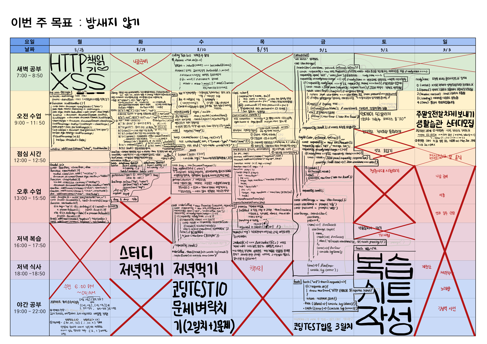

# 9주차 복습

## [JS]
### `2023 08 28 월` [[JS] svg 패스 scroll 핸들러 사용하기](https://github.com/sthgml/FES7/commit/19baa825896c41119ec699e622f2183eb706f0db)
[실행페이지](https://sthgml.github.io/FES7/HTML-CSS/20230828/index.html)

### `2023 08 29 화` [JQuery](https://github.com/sthgml/FES7/commit/1b271ebdb013ecf0631c8bd5ddb70cf253580478)
- JQuery 활용법보다 JQuery를 JS로 재현하는 방법 알기

### `2023 08 30 수` [ Node.js, npm folder](https://github.com/sthgml/FES7/commit/5722efe2514eea90a735d4017e218b10794c0130)

### `2023 08 31 목` [[JS 심화, 실습]](https://github.com/sthgml/FES7/commit/140b3a94a02c190c9510cef69241ab26d5f97683)
- 최적화 minify extenstion 등
- 브라우저 렌더링 순서
- 화살표조작 애니메이션 페이지 (requestAnimationFrame)

### `2023 09 01 금` [[Add: JS 비동기 프로그래밍 promise, fetch](https://github.com/sthgml/FES7/commit/1ca9b69f0922fe606ac4734bc35bad6fb4408fdc)]
- 비동기 - XML Callback hell > Promise 객체 > fetch

### `2023 09 02 토` [[Update: requestAnimationFrame(), promise, fetch](https://github.com/sthgml/FES7/commit/6705a51505a2fb3c7210cdd8a3a5cefafd517b8a)]
- requestAnimationFrame, promise, fetch 복습

### `2023 09 03 일` [[Update: [review-note] btn-new 로 today-modal 모달 띄우기](https://github.com/sthgml/FES7/commit/ab810818f8a2f13cc5c50946f14647ef7a5799ea)]